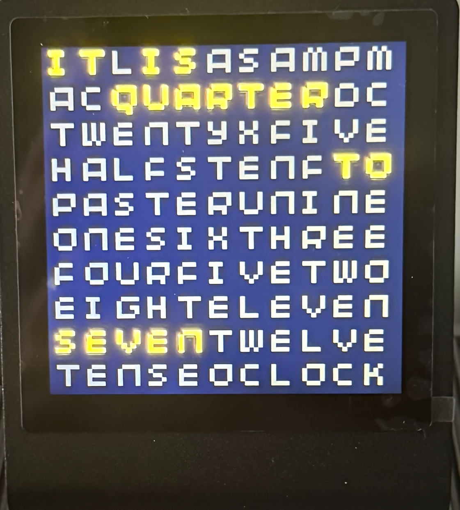
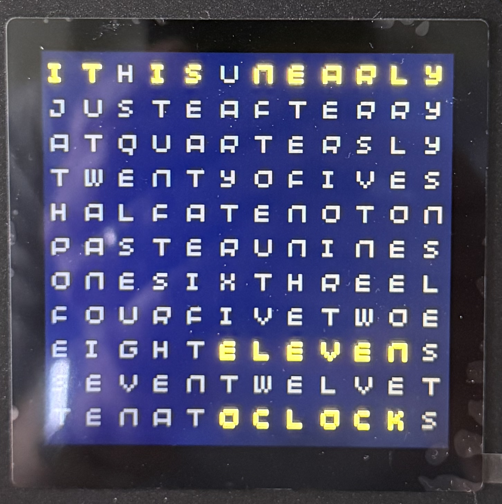
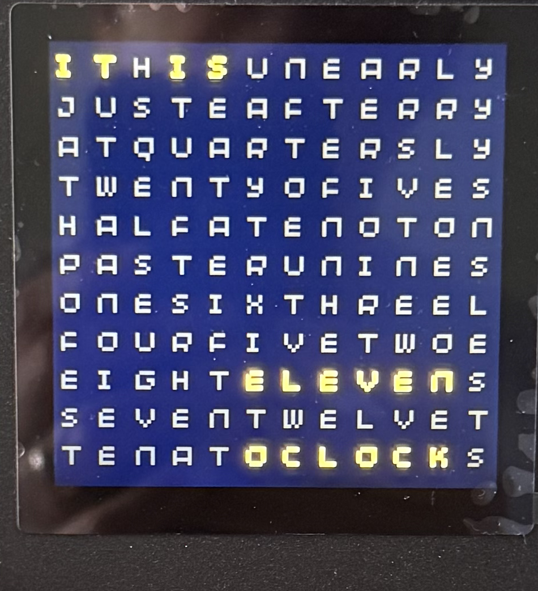

# PrestoWordClock

C++ implementation of a word clock for the [Pimoroni Presto](https://shop.pimoroni.com/products/presto?variant=54894104019323).

## Specification

Implement a NTP enabled word clock running on the Presto with the following features:

- Time is displayed as words such as **It is Ten OClock**
- The application will log on to WiFi and obtain the time from one of four NTP servers
- Spacer characters on the display will make valid English words when combined with the preceding or following characters
- Displaying the time will adhere to the following rules (shown by example)
    - 09:03 **It is nearly five past nine**
    - 09:05 **It is five past nine**
    - 09:06 **It is just after five past nine**

## How the Code was Generated

The majority of the work in this project was performed by Copilot running the Claude Sonnet 4.6 LLM.  It was created this way to:

- Examine how the LLM would deal with a brief specification
- Verify that the LLM can deal with the missing prerequisite API
    - Pico SDK and tools
    - Presto libraries
- Take an existing C sample and convert the code to make it work with the specification

In general the LLM did well.  The whole process took 1.5 hours to generate the initial application (this needed one intervention for a bug).  There was a follow up 2 hours session where the display specification was modified.

My initial estimate for to do the work myself was about 3-5 days given no familiarity with the Presto development board or the libraries.

## Building the code

There are three **bash** scripts in the repository:

- **build.sh** Build the code (this will clone the Pico and Presto support libraries if necessary)
- **flash.sh** Flash the code to the board using a [Pico Debug Probe](https://shop.pimoroni.com/products/raspberry-pi-debug-probe?variant=40511574999123)
- **debug.sh** Connect to the Presto using the debug probe for debugging

Note that you do not need to use the debug probe to flash the board as the build script will produce a uf2 file which can be flashed using the usual flash drive method.

### Prerequisites

It is necessary to produce the WiFi header file before building the code:

- Copy the **wifi.h.example** file to **wifi.h**
- Edit the file entering the following local information:
    - SSID for the local network
    - WiFi password for the network
    - Local offset from UTC (in seconds)

## Screen shots

